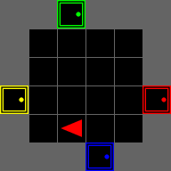

# LVLM2P

This is the official Pytorch implementation for the paper:

**Sample Efficient Reinforcement Learning via Large Vision Language Model Distillation**

Donghoon Lee*, Tung M. Luu*, Younghwan Lee, Chang D. Yoo

*equal contribution

## Features

- **Script to train**, including:
  - Log in txt, CSV and Tensorboard
  - Save model
  - Stop and restart training
  - Use A2C or PPO algorithms
- **Script to visualize**, including:
  - Act by sampling or argmax
  - Save as Gif
- **Script to evaluate**, including:
  - Act by sampling or argmax
  - List the worst performed episodes

## Installation


1. Clone this repository.

2. Install dependencies

```
pip3 install -r requirements.txt
```

**Note:** If you want to modify `torch-ac` algorithms, you will need to rather install a cloned version, i.e.:
```
git clone https://github.com/lcswillems/torch-ac.git
cd torch-ac
pip3 install -e .
```

## Gemini API keys setup

To run this repository, you need to set up your Gemini API keys. Use the following command to add your keys:

```
python update_keys.py --api-keys key1 key2 key3
```

## Example of use

Train, visualize an student agent on the `MiniGrid-GoToDoor-6x6-v0` environment:

<p align="center"></p>

1. **Train** the student agent on the `MiniGrid-GoToDoor-6x6-v0` environment with PPO algorithm:

```
python3 -m scripts.train --algo ppo --env MiniGrid-GoToDoor-6x6-v0 --action-option train_ppo_from_vlm
```

2. **Visualize** student agent's behavior

<p align="center"></p>

```
python3 -m scripts.visualize --env MiniGrid-GoToDoor-6x6-v0 --model DoorKey
```

## Note

These files are suited for [`minigrid`](https://github.com/Farama-Foundation/Minigrid) environments and [`torch-ac`](https://github.com/lcswillems/torch-ac) RL algorithms. They are easy to adapt to other environments and RL algorithms by modifying:
- `model.py`
- `utils/format.py`

## The code will soon include the implementation of other teacher policies (LVLM), specifically leveraging GPT-4V and Qwen2-VL.


## Citation

The citation for this repository will be updated.

```

## Acknowledgements
This code is based on top of :
[Minigrid](https://github.com/Farama-Foundation/Minigrid?tab=readme-ov-file) , 
[RL Starter Files](https://github.com/lcswillems/rl-starter-files?tab=readme-ov-file) , 
[PyTorch Actor-Critic deep reinforcement learning algorithms: A2C and PPO](https://github.com/lcswillems/torch-ac).